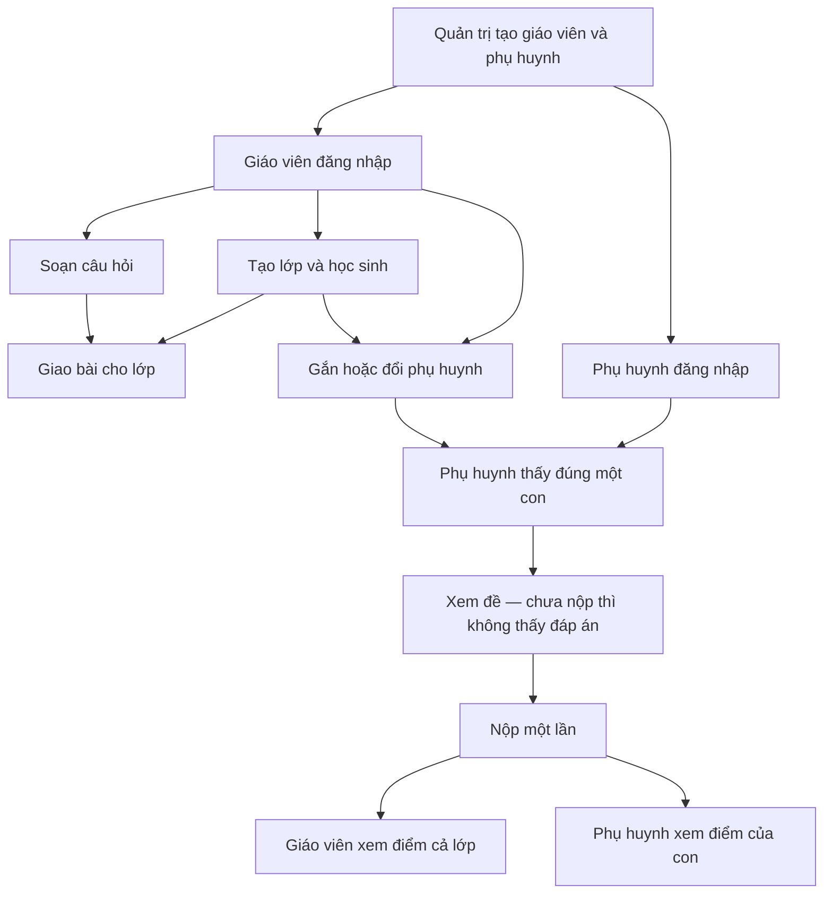

# Teaching Assistant — Tài liệu nghiệp vụ

Tài liệu này mô tả **sản phẩm đang hướng tới và đang chạy**. Đọc được cho giáo viên, phụ huynh, quản trị, product và kỹ thuật. Không cần biết lập trình.

Cập nhật: 26/09/2026.

---

## 1. Sản phẩm làm gì

Teaching Assistant giúp **giáo viên tiểu học (lớp 1–5)**:

1. Tự soạn **ngân hàng câu hỏi** (trắc nghiệm và đúng/sai).
2. Gom câu cùng loại thành **bộ** để ôn / chơi — bộ này **không** phải bài giao cho lớp.
3. Tạo **lớp**, thêm học sinh, mỗi em có **mã học sinh** (dạng `HS260916-M7KQ`).
4. **Giao bài tập** cho cả lớp, có ngày hết hạn.
5. Chọn **một phụ huynh** cho **một học sinh**.
6. Phụ huynh **xem bài của con, làm hộ, xem điểm**.

**Học sinh không có tài khoản.** Em không đăng nhập. Phụ huynh làm bài thay con.

Chưa làm: năm học mới, chuyển lớp.

---

## 2. Ai dùng hệ thống

Có **ba loại người**, mỗi người một việc.

| Người | Việc | Tài khoản lấy từ đâu |
|---|---|---|
| **Quản trị (admin)** | Tạo tài khoản giáo viên và phụ huynh | Tạo sẵn trong hệ thống / dữ liệu mẫu. Không tự đăng ký. |
| **Giáo viên** | Câu hỏi, lớp, giao bài, gắn phụ huynh, xem điểm cả lớp | Quản trị tạo |
| **Phụ huynh** | Xem đúng một con, làm bài, xem điểm của con | Quản trị tạo |

Phụ huynh **không** vào ngân hàng câu hỏi, không tạo lớp, không xem điểm học sinh khác.  
Giáo viên **không** nộp bài hộ (việc đó của phụ huynh).

Cách đăng nhập cũ “tự đăng ký giáo viên” vẫn còn trong hệ thống nhưng **không dùng** cho nghiệp vụ chính.

---

## 3. Các khái niệm đơn giản

| Tên | Nghĩa |
|---|---|
| **Câu hỏi** | Một câu trắc nghiệm hoặc đúng/sai, thuộc giáo viên soạn. |
| **Bộ câu hỏi** | Nhóm nhiều câu **cùng loại**, để ôn. Xóa bộ **không** xóa câu. |
| **Lớp** | Một lớp của một giáo viên, có danh sách học sinh. |
| **Học sinh** | Hồ sơ: tên, mã, đang học / đã nghỉ (ẩn khỏi lớp). Không đăng nhập. |
| **Phụ huynh ↔ học sinh** | Một phụ huynh chỉ một con. Một con chỉ một phụ huynh. |
| **Bài tập (homework)** | Giáo viên giao cho **một lớp**: chọn sẵn danh sách câu + ngày hết hạn. Có thể trộn trắc nghiệm và đúng/sai trong cùng một bài. |
| **Bài nộp** | Một em nộp **một lần** cho một bài. Hệ thống chấm điểm khi **mở xem**, không lưu sẵn cột điểm. |

Sửa bộ câu hỏi **sau khi đã giao bài** không đổi đề bài đã giao.

---

## 4. Quy tắc đã thống nhất

### Phụ huynh và học sinh

- Một phụ huynh — một học sinh. Không bố và mẹ cùng một em. Không một phụ huynh hai con.
- Giáo viên gắn hoặc **đổi** phụ huynh bằng **mã học sinh** + tài khoản phụ huynh.
- Chỉ gắn khi: học sinh **đang học**, thuộc **lớp của giáo viên đó**, và tài khoản kia đúng là **phụ huynh**.
- Đổi phụ huynh: người mới **đã có con rồi** thì báo lỗi, không gắn.
- Phụ huynh cũ hết con thì gắn được học sinh khác sau.
- Phụ huynh chỉ xem / nộp / xem điểm **con của mình**.

### Lớp

- Tạo lớp: gửi **danh sách tên** → hệ thống tạo hồ sơ và mã.
- Sửa danh sách: gửi **mã cũ giữ lại** + **tên mới**.
  - Tên mới → thêm học sinh.
  - Không gửi lại mã cũ → học sinh **nghỉ** (ẩn), không xóa sạch (còn bài nộp / phụ huynh).
- Xem lớp thấy học sinh và phụ huynh đã gắn (nếu có).

**Xóa lớp:** xóa cả lớp và dữ liệu kèm, **trừ khi** đã có học sinh **đã gắn phụ huynh** và học sinh đó **đã nộp bài**. Khi đó không cho xóa.

### Bài tập và nộp

- Giáo viên chỉ giao bài cho lớp của mình. Ứng dụng gửi sẵn danh sách câu (không chọn “cả bộ” một phát).
- Phụ huynh nộp khi đã đăng nhập. Hệ thống tự biết con nào, không cần chọn con.
- Con phải đúng lớp của bài đó.
- Làm hết câu: trắc nghiệm chọn một đáp án; đúng/sai chọn đúng hoặc sai.
- **Không nộp lại.** **Không nộp sau hạn.**
- Ngày hết hạn tính theo **UTC** (ngày trên bài, không đổi sang giờ Việt Nam).
- Điểm: câu dễ / vừa / khó nặng 1 / 2 / 3, tổng 100. Chấm lúc mở xem.

**Đáp án**

- Phụ huynh **chưa nộp**: xem đề, **không** thấy đáp án đúng và lời giải.
- Phụ huynh **đã nộp**: thấy đáp án và điểm của con.
- Giáo viên **luôn** thấy đáp án và điểm cả lớp.

### Sửa / xóa câu và bài

- Không xóa câu nếu câu đang nằm trong bộ, bài giao, hoặc bài nộp.
- Không đổi đáp án / loại câu / độ khó nếu đã có em nộp câu đó.
- Không xóa bài giao / không đổi danh sách câu nếu đã có bài nộp.

---

## 5. Việc mỗi người làm hàng ngày

### Quản trị

Đăng nhập → tạo tài khoản giáo viên hoặc phụ huynh (tên, email, mật khẩu, chọn đúng vai trò).

### Giáo viên

1. Đăng nhập.
2. Soạn câu trắc nghiệm / đúng-sai.
3. (Tuỳ) gom thành bộ để ôn.
4. Tạo lớp, nhập tên học sinh, nhận mã từng em.
5. Gắn hoặc đổi phụ huynh bằng mã học sinh.
6. Giao bài: chọn lớp, chọn câu, đặt hạn nộp.
7. Xem bài nộp và điểm cả lớp.

### Phụ huynh

1. Đăng nhập (tài khoản quản trị đã tạo).
2. Thấy **một** con.
3. Thấy danh sách bài của lớp con.
4. Làm bài, nộp **một lần**.
5. Xem điểm và đáp án sau khi nộp.

Không còn đường nộp “không cần đăng nhập”.

---

## 6. Hệ thống đã chạy được

Những phần dưới **đã có** và dùng được cho luồng chính (giáo viên soạn bài, phụ huynh nộp, giáo viên xem điểm).

- Đăng nhập theo vai trò. Quản trị tạo giáo viên / phụ huynh. Không tạo quản trị qua màn hình tạo user.
- Giáo viên: câu hỏi, bộ câu hỏi, lớp, danh sách học sinh, giao / sửa / xóa bài (khi chưa có em nộp).
- Giáo viên xem bài nộp cả lớp, kèm điểm.
- Phụ huynh đăng nhập, thấy một con, thấy bài của lớp con, nộp bài đã đăng nhập.
- Một em một bài: nộp lần hai bị từ chối.
- Hết hạn thì không nộp được.
- Lỗi thông thường trả về rõ (sai dữ liệu / không có quyền / không tìm thấy / trùng), không gộp thành “lỗi hệ thống” hết.
- Dữ liệu mẫu để demo (mật khẩu chung `Demo@123`):
  - Quản trị: `admin@demo.local`
  - Giáo viên: `gv.lan@demo.local`, `gv.minh@demo.local`
  - Phụ huynh: `ph.01@demo.local` …

---

## 7. Việc phải sửa ngay (trước khi làm chức năng mới)

Đây là chỗ **nghiệp vụ đã chốt nhưng phần mềm chưa đúng**. Nếu bỏ qua, phụ huynh / giáo viên sẽ thấy sai hoặc demo hỏng. Nên xử lý hết mục này rồi mới thêm tính năng mới.

| # | Việc | Vì sao phải sửa ngay | Người bị ảnh hưởng |
|---|---|---|---|
| 1 | **Phụ huynh xem điểm của con đang hỏng đường vào** | Đường “xem bài đã nộp của con” bị nhầm với đường “xem một bài theo mã”. Phụ huynh hay bị từ chối, không vào được điểm. | Phụ huynh |
| 2 | **Phụ huynh đang làm bài vẫn thấy đáp án đúng** | Đề bài hiện cả đáp án và lời giải. Con / phụ huynh có thể nhìn đáp án rồi mới nộp. | Phụ huynh, giáo viên (điểm không còn ý nghĩa) |
| 3 | **Gắn phụ huynh chưa đủ điều kiện; chưa đổi được người** | Hệ thống chưa chắc học sinh đang học, chưa chắc thuộc lớp giáo viên đang dùng, chưa chắc tài khoản kia là phụ huynh. Gắn lần hai (đổi bố/mẹ) chưa thay người cũ — dễ báo trùng hoặc gắn sai. | Giáo viên, phụ huynh |
| 4 | **Dữ liệu mẫu chưa đúng “một phụ huynh một con”** | Có phụ huynh đang gắn hai học sinh. Khi bật quy tắc “một người một con”, dữ liệu mẫu có thể không chạy hoặc demo lệch. | Cả đội khi demo / test |

**Làm xong 4 việc trên** thì luồng “gắn con → xem đề → nộp → xem điểm” đủ để chuyển sang chức năng mới.

---

## 8. Lệch nhẹ — không chặn chức năng mới

Có thể để sau, ghi nhận để khỏi quên:

| Việc | Hiện trạng | Ý đã chốt |
|---|---|---|
| Xem điểm của con | Còn kiểm tra “ai đã bấm nộp”. Bài mẫu (không ghi người nộp) vẫn xem được. | Chỉ cần đúng con của phụ huynh đó. |
| Xóa lớp | Không xóa được nếu lớp **còn bài giao**, dù chưa ai nộp. Xóa lớp cũng chưa dọn hết học sinh. | Xóa được trừ khi đã gắn phụ huynh **và** đã có bài nộp. |
| Câu “kéo thả / ghép cặp” | Vẫn còn trong kho câu hỏi. | Sản phẩm chỉ dùng trắc nghiệm và đúng/sai. Giáo viên đừng dùng loại này; có thể khóa sau. |
| Màn tạo tài khoản | Ứng dụng đã từ chối vai trò quản trị / học sinh. Form cũ vẫn ghi các vai trò đó. | Chỉ giáo viên và phụ huynh. |

**Chủ ý không làm lúc này:** năm học / chuyển lớp; giao bài bằng “chọn cả bộ”; nộp lại / nộp trễ; học sinh tự đăng nhập.

---

## 9. Kết luận cho đội

- **Luồng giáo viên soạn bài → giao bài → xem điểm lớp:** dùng được.
- **Luồng phụ huynh xem đề → nộp:** dùng được, nhưng **đề đang lộ đáp án**.
- **Luồng phụ huynh xem điểm sau khi nộp:** **chưa tin dùng** vì đường vào đang sai.
- **Gắn / đổi phụ huynh:** chưa đủ an toàn theo quy tắc đã chốt.
- **Demo dữ liệu mẫu:** cần chỉnh cho đúng một phụ huynh một con.

**Khuyến nghị:** sửa mục **§7 (bốn việc)** rồi mới mở chức năng mới. Mục §8 không chặn nếu đội chấp nhận nợ.
