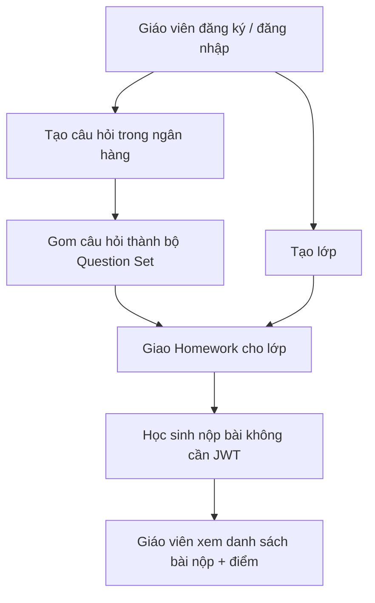
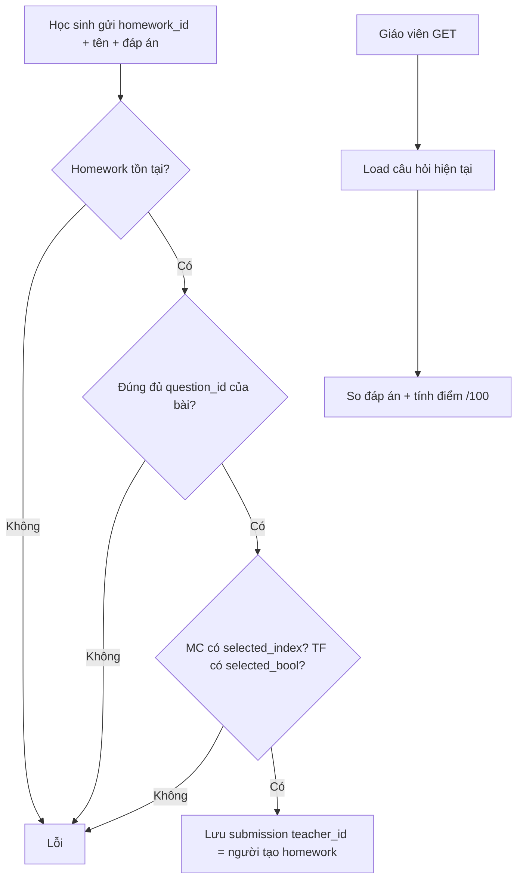

# Teaching Assistant — Chức năng và luồng hệ thống

Backend API hỗ trợ giáo viên quản lý ngân hàng câu hỏi, bộ câu hỏi, lớp học, giao bài tập và xem bài nộp của học sinh.

- **Prefix:** `/api/v1`
- **Stack:** Go, Fiber, MongoDB, JWT, Cloudinary
- **Frontend CORS:** `http://localhost:5173`, `https://teachingassistantfe.netlify.app`

---

## 1. Người dùng và vai trò

Hệ thống hiện xoay quanh **giáo viên** (role mặc định khi đăng ký: `user`).

| Vai trò | Việc chính |
|---|---|
| Giáo viên (JWT) | Tạo/sửa/xóa câu hỏi, bộ câu hỏi, lớp, bài tập; xem bài nộp |
| Học sinh (không login) | Nộp bài qua `POST /homework-submissions` (gửi tên + đáp án) |

Học sinh **không có tài khoản**. Giáo viên gắn danh sách `students` (ID hex) vào lớp, nhưng API **chưa kiểm tra** ID đó có tồn tại hay thuộc lớp khi nộp bài.

---

## 2. Mô hình dữ liệu

```
User (giáo viên)
 ├── Question          ngân hàng câu hỏi (ảnh matching → Cloudinary)
 ├── QuestionSet       nhóm câu hỏi cùng loại (lưu question_ids)
 ├── Class             lớp học (ảnh lớp → Cloudinary, students[])
 │    └── Homework     bài tập giao cho 1 lớp (copy danh sách question ids)
 │         └── HomeworkSubmission   bài nộp (public), teacher_id = giáo viên tạo homework
```

**Homework không lưu `question_set_id`.** Giáo viên chọn câu hỏi (thường từ bộ câu hỏi ở FE), API chỉ nhận mảng ID và **sao chép** vào homework. Sửa/xóa bộ câu hỏi sau đó **không** đổi bài tập đã giao.

MongoDB không có foreign key. Quan hệ được kiểm tra ở tầng usecase.

### Collection

| Collection | Ý nghĩa |
|---|---|
| `users` | Tài khoản giáo viên |
| `questions` | Câu hỏi |
| `question_sets` | Bộ câu hỏi (`question_ids`) |
| `classes` | Lớp |
| `homeworks` | Bài tập (`class_id`, `questions[]`) |
| `homework_submissions` | Bài nộp (`homework_id`, `student_answers[]`) |

---

## 3. Kiến trúc

```
HTTP (Fiber handler / request / response / mapper)
        ↓
Usecase (nghiệp vụ)
        ↓
Domain (entity, repository interface, error)
        ↓
MongoDB repository  +  Cloudinary  +  JWT
```

Luồng request điển hình:

```
Client
  → Router (/api/v1)
  → Auth middleware (nếu cần)
  → Handler (parse body / query)
  → Usecase (validate + rule)
  → Repository / Cloudinary
  → Mapper → JSON envelope
```

---

## 4. Chuẩn API chung

### Envelope

Thành công:

```json
{
  "success": true,
  "message": "...",
  "data": {}
}
```

Lỗi:

```json
{
  "success": false,
  "message": "...",
  "error": { "code": "UNAUTHORIZED" }
}
```

`data` phân trang thường chứa luôn `meta` bên trong (không dùng field `meta` gốc của envelope).

### Auth

Hầu hết route (trừ register/login và **nộp bài**) cần:

```
Authorization: Bearer <jwt>
```

JWT chứa `user_id`, `username`, `email`, `role`. Hết hạn theo `JWT_EXPIRE_HOURS` (mặc định 24 giờ nếu không set).

Logout hiện **không thu hồi token** — chỉ kiểm tra user còn tồn tại. Client tự xóa token.

### Phân trang

Query: `page_index` (mặc định 1), `page_size` (mặc định 10, tối đa 100).

```json
{
  "page": 1,
  "limit": 10,
  "total": 42,
  "total_pages": 5
}
```

### Upload

- Body tối đa **10MB** (Fiber).
- Ảnh matching / ảnh lớp: tối đa **5MB / file**.
- Ảnh được upload Cloudinary, lưu URL + `public_id`.

---

## 5. Flow tổng thể (giáo viên → học sinh)



Thứ tự thực tế khi dùng:

1. Đăng ký / login → lấy JWT.
2. Tạo câu hỏi (`multiple_choice` / `true_false` / `matching`).
3. (Tuỳ chọn) tạo bộ câu hỏi cùng loại.
4. Tạo lớp.
5. Tạo homework: chọn lớp + danh sách câu hỏi + hạn nộp.
6. Học sinh nộp JSON công khai.
7. Giáo viên GET submissions — hệ thống **chấm điểm lúc đọc**, không lưu điểm lúc nộp.

---

## 6. Auth

| Method | Path | Auth | Mô tả |
|---|---|---|---|
| POST | `/auth/register` | Không | Tạo user, trả JWT |
| POST | `/auth/login` | Không | Đăng nhập, trả JWT |
| POST | `/auth/logout` | Bearer | Xác nhận user tồn tại |

**Register**

```json
{
  "username": "gv01",
  "email": "gv01@school.vn",
  "password": "secret123"
}
```

**Login**

```json
{
  "email": "gv01@school.vn",
  "password": "secret123"
}
```

**Response**

```json
{
  "token": "<jwt>",
  "user": {
    "id": "...",
    "username": "gv01",
    "email": "gv01@school.vn",
    "role": "user"
  }
}
```

Mật khẩu hash bằng bcrypt. Role mặc định `user`.

---

## 7. Câu hỏi (Question)

Ngân hàng câu hỏi **theo giáo viên** (`created_by`). List chỉ trả câu hỏi của chính user đó.

### Loại câu hỏi

| `type` | Nội dung | Đáp án đúng |
|---|---|---|
| `multiple_choice` | `options[]` | `correct_index` (0-based) |
| `true_false` | — | `correct_bool` |
| `matching` | `pairs[]` | từng cặp left/right |

**Matching pair**

- Mỗi bên: `text` hoặc `image`.
- Ảnh: file multipart, **không** gửi URL từ client.
- Field file: `pairs[i].left_image`, `pairs[i].right_image`.
- Lưu Cloudinary URL + `public_id`.
- Sửa: `kind=image` mà **không** gửi file → giữ ảnh cũ. Gửi file mới → upload mới, xóa ảnh cũ trên Cloudinary sau khi DB update thành công.

### Metadata

- **Subject:** `vietnamese`, `mathematics`, `ethics`, `english`, `nature_and_society`, `history_and_geography`, `science`, `informatics`, `technology`, `physical_education`, `music`, `art`, `experiential_activities`
- **Grade:** `1` … `5`
- **Difficulty:** `easy` / `medium` / `hard` — dùng khi chấm điểm (1 / 2 / 3)

### API

| Method | Path | Auth | Body |
|---|---|---|---|
| POST | `/questions` | Bearer | multipart `form` |
| GET | `/questions` | Bearer | query filter + phân trang |
| GET | `/questions/:id` | Bearer | — |
| PUT | `/questions/:id` | Bearer | multipart `form` |
| DELETE | `/questions/:id` | Bearer | — |

**GET filter:** `question_type`, `question_name` (regex, không phân biệt hoa thường), `subject`, `grade`, `difficulty`, `page_index`, `page_size`.

**Tạo matching (form)**

- `type=matching`
- `pairs[0].left_kind=text`, `pairs[0].left=Con mèo`
- `pairs[0].right_kind=image` + file `pairs[0].right_image`

### Ràng buộc

- Chỉ owner được sửa/xóa.
- **Không xóa** nếu câu hỏi đang nằm trong bộ câu hỏi, homework, hoặc bài nộp.
- **Không đổi** type / difficulty / options / đáp án / pairs nếu câu hỏi đã xuất hiện trong bài nộp (tránh lệch điểm lịch sử). Vẫn sửa được đề bài, môn, khối, giải thích.

---

## 8. Bộ câu hỏi (Question Set)

Nhóm câu hỏi **cùng một loại** để dùng cho game / ôn tập. Không phải bài tập.

| Method | Path | Auth |
|---|---|---|
| POST | `/question-sets` | Bearer |
| GET | `/question-sets` | Bearer |
| GET | `/question-sets/:id` | Bearer |
| PUT | `/question-sets/:id` | Bearer |
| DELETE | `/question-sets/:id` | Bearer |

**Tạo (JSON)**

```json
{
  "title": "Trắc nghiệm Toán 3",
  "question_type": "multiple_choice",
  "description": "Tuần 1",
  "questions": ["<question_id_hex>", "<question_id_hex>"]
}
```

- Tạo: load câu hỏi, **reject** nếu type không khớp `question_type`.
- Sửa: có thể đổi title / description / danh sách ID; **hiện không** validate lại type/tồn tại khi update.
- Xóa set: **chỉ xóa bộ**, không xóa câu hỏi.
- GET list: query `title`, `question_type`, `page_index`, `page_size`.
- Response nhúng object câu hỏi; ID không còn trong DB thì bị bỏ qua.

---

## 9. Lớp (Class)

| Method | Path | Auth | Body |
|---|---|---|---|
| POST | `/classes` | Bearer | multipart |
| GET | `/classes` | Bearer | `name`, phân trang |
| GET | `/classes/:id` | Bearer | — |
| PUT | `/classes/:id` | Bearer | multipart |
| DELETE | `/classes/:id` | Bearer | — |

**Form tạo/sửa:** `name`, `description`, `image` (optional), `students` (lặp key, mảng ID hex).

- List / get / update / delete: chỉ owner.
- Đổi ảnh: upload mới, xóa `public_id` cũ trên Cloudinary.
- **Không xóa lớp** nếu còn homework thuộc lớp đó.

`students[]` chưa được verify (chưa check user tồn tại).

---

## 10. Bài tập (Homework)

Homework gắn **một lớp** + **danh sách câu hỏi** + hạn nộp.

| Method | Path | Auth |
|---|---|---|
| POST | `/homeworks` | Bearer |
| GET | `/homeworks` | Bearer |
| GET | `/homeworks/:id` | Bearer |
| PUT | `/homeworks/:id` | Bearer |
| DELETE | `/homeworks/:id` | Bearer |
| GET | `/homeworks/class/:class_id` | Bearer |

> Route `GET /homeworks/:id` được đăng ký **trước** `GET /homeworks/class/:class_id`. Fiber sẽ bắt `/homeworks/class/...` như `id = "class"`. Nên lấy bài theo lớp qua query/list hoặc sửa thứ tự route nếu FE cần path này.

**Tạo (JSON)**

```json
{
  "class_id": "<class_hex>",
  "title": "Bài 1",
  "description": "Làm trong 20 phút",
  "questions": ["<qid1>", "<qid2>"],
  "due_date": "2026-09-15"
}
```

`due_date` format `2006-01-02`, lưu UTC. Không chặn nộp sau hạn ở backend.

### Ràng buộc

- Tạo: lớp phải tồn tại và **thuộc giáo viên**; mọi question ID phải tồn tại.
- Sửa `class_id`: lớp mới cũng phải thuộc giáo viên.
- Sửa danh sách câu hỏi: **cấm** nếu đã có bài nộp.
- Xóa homework: **cấm** nếu đã có bài nộp.
- GET: chỉ owner; response nhúng object câu hỏi (ID mất thì bỏ qua).

---

## 11. Bài nộp (Homework Submission)

| Method | Path | Auth |
|---|---|---|
| POST | `/homework-submissions` | **Không** |
| GET | `/homework-submissions` | Bearer (giáo viên) |
| GET | `/homework-submissions/:id` | Bearer (giáo viên) |

Không có update/delete submission.

### Flow nộp bài



**Request nộp (không Bearer)**

```json
{
  "homework_id": "<homework_hex>",
  "student_name": "Nguyen Van A",
  "student_answers": [
    { "question_id": "<qid1>", "selected_index": 2 },
    { "question_id": "<qid2>", "selected_bool": true }
  ]
}
```

Validate:

- Đủ và **khớp exact** tập `question_id` của homework (không thiếu, không thừa, không trùng).
- `multiple_choice` bắt buộc `selected_index`.
- `true_false` bắt buộc `selected_bool`.
- **Matching chưa hỗ trợ nộp** — bị reject.
- Không check hạn nộp, không check học sinh thuộc lớp, không chặn nộp trùng.

GET list/detail: chỉ bài có `teacher_id` = user đang login. Điểm **tính lúc đọc**.

---

## 12. Chấm điểm

Điểm **không lưu** lúc nộp. GET submission so đáp án với câu hỏi **hiện tại** trong DB.

| Difficulty | Trọng số |
|---|---|
| easy | 1 |
| medium | 2 |
| hard | 3 |

- Tổng điểm tối đa luôn **100**.
- Điểm mỗi câu = `100 * weight / tổng weight`, làm tròn 2 số.
- Câu cuối nhận phần dư để tổng max = 100.
- Đúng: cộng `max_score` của câu. Sai: 0.
- So sánh:
  - MC: `selected_index == correct_index`
  - TF: `selected_bool == correct_bool`
  - Matching / thiếu câu hỏi: coi như sai

Response mỗi đáp án: `is_correct`, `score`, `max_score`, kèm object `question`.

**Hệ quả:** sửa đáp án / độ khó của câu hỏi đã có bài nộp sẽ làm **điểm lịch sử đổi**. Vì vậy update các field chấm điểm bị chặn khi câu hỏi đã nằm trong submission.

---

## 13. Ràng buộc tham chiếu (tránh dữ liệu mồ côi)

```
Xóa Question      → cấm nếu có trong question_sets.question_ids
                    HOẶC homeworks.questions
                    HOẶC submissions.student_answers.question_id

Sửa đáp án/type/difficulty/options/pairs của Question
                    → cấm nếu đã có submission dùng câu đó

Xóa Class         → cấm nếu còn homework.class_id

Xóa Homework      → cấm nếu còn submission.homework_id

Sửa Homework.questions
                    → cấm nếu đã có submission

Xóa QuestionSet   → được (không xóa câu hỏi)
```

Thứ tự xóa an toàn:

1. (Không xóa submission — chưa có API delete)
2. Muốn xóa homework → không được còn bài nộp
3. Muốn xóa lớp → xóa hết homework trước
4. Muốn xóa câu hỏi → gỡ khỏi set + homework, và không được còn trong bài nộp

---

## 14. Bảng API đầy đủ

Prefix: `/api/v1`

| Method | Path | Auth | Ghi chú |
|---|---|---|---|
| POST | `/auth/register` | — | Trả token |
| POST | `/auth/login` | — | Trả token |
| POST | `/auth/logout` | JWT | Không blacklist token |
| POST | `/questions` | JWT | multipart |
| GET | `/questions` | JWT | filter + page |
| GET | `/questions/:id` | JWT | |
| PUT | `/questions/:id` | JWT | multipart |
| DELETE | `/questions/:id` | JWT | chặn nếu đang dùng |
| POST | `/question-sets` | JWT | JSON |
| GET | `/question-sets` | JWT | |
| GET | `/question-sets/:id` | JWT | |
| PUT | `/question-sets/:id` | JWT | |
| DELETE | `/question-sets/:id` | JWT | không xóa câu hỏi |
| POST | `/classes` | JWT | multipart |
| GET | `/classes` | JWT | |
| GET | `/classes/:id` | JWT | |
| PUT | `/classes/:id` | JWT | multipart |
| DELETE | `/classes/:id` | JWT | chặn nếu còn homework |
| POST | `/homeworks` | JWT | JSON |
| GET | `/homeworks` | JWT | |
| GET | `/homeworks/:id` | JWT | |
| PUT | `/homeworks/:id` | JWT | |
| DELETE | `/homeworks/:id` | JWT | chặn nếu còn submission |
| GET | `/homeworks/class/:class_id` | JWT | xem mục 10 về thứ tự route |
| POST | `/homework-submissions` | **Không** | học sinh nộp |
| GET | `/homework-submissions` | JWT | giáo viên, có điểm |
| GET | `/homework-submissions/:id` | JWT | giáo viên, có điểm |

---

## 15. Cấu hình

Biến môi trường (file `.env`):

| Biến | Ý nghĩa |
|---|---|
| `HOST` | Host lắng nghe |
| `PORT` | Port (thường `2000`) |
| `MONGODB_URI` | Connection string |
| `MONGODB_DB_NAME` | Tên database |
| `JWT_SECRET` | Secret ký token |
| `JWT_EXPIRE_HOURS` | Thời hạn token |
| `CLOUDINARY_URL` | Upload ảnh |

Entry: `cmd/api/main.go` — load config, chạy Fiber, shutdown graceful (SIGINT/SIGTERM, 10s).

---

## 16. Giới hạn hiện tại (cần biết khi integrate FE)

- Nộp bài **public**: ai có `homework_id` cũng nộp được; không chống spam / nộp trùng.
- Không chặn nộp sau `due_date`.
- Matching chưa nộp / chưa chấm.
- `students` trên lớp chưa verify.
- GET list (set / homework / submission) **bỏ qua** câu hỏi đã xóa → điểm có thể lệch nếu data cũ lọt qua ràng buộc.
- Nhiều handler vẫn trả **500** + message domain (kể cả lỗi nghiệp vụ như “đang được dùng”), không phải lúc nào cũng 409.
- Logout không vô hiệu hóa JWT đã cấp.
- Homework không snapshot nội dung câu hỏi — chỉ lưu ID; chấm theo bản câu hỏi mới nhất.
