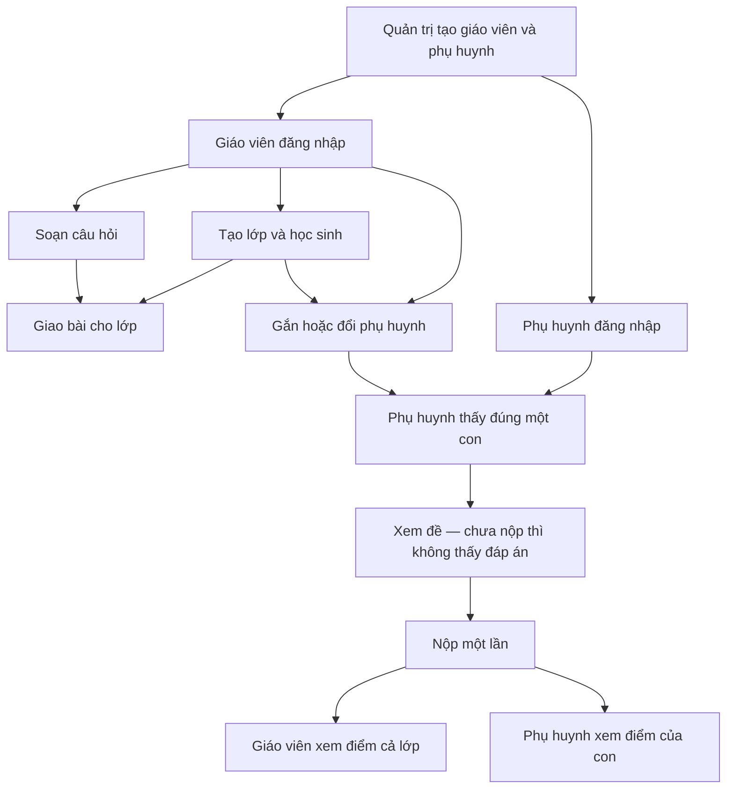

# Teaching Assistant — Nghiệp vụ và luồng sử dụng

Tài liệu cho **mọi người**: giáo viên, phụ huynh, quản trị, product, thiết kế, kỹ thuật. Không cần biết lập trình.

Hợp đồng gọi máy cho frontend: xem [API.md](API.md).

Cập nhật: 27/09/2026.

---

## Sản phẩm này để làm gì?

Giáo viên tiểu học (lớp 1–5) soạn câu hỏi, tạo lớp, giao bài. **Học sinh không có tài khoản.** Phụ huynh đăng nhập, làm bài **hộ con**, rồi xem điểm.

Chưa làm: năm học mới, chuyển lớp, học sinh tự đăng nhập.

---

## Ba loại người

| Người | Việc chính | Tài khoản |
|---|---|---|
| **Quản trị** | Tạo tài khoản giáo viên và phụ huynh | Có sẵn trong hệ thống (không tự đăng ký) |
| **Giáo viên** | Câu hỏi, lớp, gắn phụ huynh, giao bài, xem điểm cả lớp | Quản trị tạo |
| **Phụ huynh** | Thấy đúng một con, làm bài, xem điểm của con | Quản trị tạo |

Phụ huynh không vào kho câu hỏi, không tạo lớp, không xem điểm học sinh khác.  
Giáo viên không nộp bài hộ — việc đó của phụ huynh.

---

## Các từ dùng trong hệ thống

| Từ | Nghĩa đời thường |
|---|---|
| **Câu hỏi** | Một câu trắc nghiệm hoặc đúng/sai do giáo viên soạn |
| **Bộ câu hỏi** | Nhiều câu **cùng loại**, để ôn. Xóa bộ không xóa câu |
| **Lớp** | Một lớp của một giáo viên, có danh sách học sinh |
| **Học sinh** | Hồ sơ: tên, mã thẻ (ví dụ `HS260916-M7KQ`), đang học hoặc đã nghỉ. Không đăng nhập |
| **Gắn phụ huynh** | Giáo viên chọn một phụ huynh cho một học sinh |
| **Bài tập** | Giáo viên giao cho **cả một lớp**: danh sách câu + ngày hết hạn |
| **Bài nộp** | Một em nộp **một lần** cho một bài. Máy chấm điểm khi **mở xem** |

Một phụ huynh chỉ một con. Một con chỉ một phụ huynh.

---

## Quy tắc cần nhớ

**Gắn / đổi phụ huynh**

- Học sinh phải **đang học**, thuộc **lớp của giáo viên đang dùng**.
- Tài khoản được chọn phải là **phụ huynh**.
- Đổi được người. Phụ huynh mới **đã có con rồi** thì không gắn được.
- Phụ huynh cũ hết con thì gắn được học sinh khác sau.

**Lớp**

- Tạo lớp: nhập **danh sách tên** → hệ thống tạo hồ sơ và mã.
- Sửa danh sách: giữ **mã cũ** + thêm **tên mới**. Bỏ mã cũ = học sinh **nghỉ** (ẩn, không xóa sạch).
- Xóa lớp: hệ thống hiện **không xóa** nếu lớp còn bài giao. Ý định lâu dài: xóa được trừ khi đã gắn phụ huynh **và** đã có bài nộp.

**Bài tập**

- Chỉ giao cho lớp của mình. Chọn từng câu (không “chọn cả bộ một phát”).
- Một bài có thể trộn trắc nghiệm và đúng/sai.
- Không nộp lại. Không nộp sau hạn (ngày hạn theo UTC).
- Điểm: câu dễ / vừa / khó nặng 1 / 2 / 3, tổng 100.

**Đáp án**

- Phụ huynh **chưa nộp**: thấy đề, **không** thấy đáp án đúng và lời giải.
- Phụ huynh **đã nộp**: thấy đáp án và điểm của con.
- Giáo viên **luôn** thấy đáp án và điểm cả lớp.

**Sửa / xóa câu**

- Không xóa câu nếu đang nằm trong bộ, bài giao, hoặc bài nộp.
- Không đổi đáp án / loại câu nếu đã có em nộp câu đó.
- Không xóa bài / không đổi danh sách câu nếu đã có bài nộp.

---

## Luồng tổng

---

## Việc từng người làm

### Quản trị

1. Đăng nhập.
2. Tạo giáo viên hoặc phụ huynh (tên, email, mật khẩu, chọn đúng vai trò).
3. Không tạo thêm quản trị trên màn hình này.

### Giáo viên

1. Đăng nhập.
2. Soạn câu trắc nghiệm / đúng-sai (có thể gom thành bộ để ôn).
3. Tạo lớp, nhập tên học sinh, nhận **mã** từng em.
4. Gắn hoặc đổi phụ huynh bằng **mã học sinh** + tài khoản phụ huynh.
5. Giao bài: chọn lớp, chọn câu, đặt hạn nộp.
6. Xem bài nộp và điểm cả lớp.

### Phụ huynh

1. Đăng nhập (tài khoản quản trị đã tạo).
2. Thấy **một** con.
3. Thấy danh sách bài của lớp con. Chưa nộp thì **không** thấy đáp án.
4. Làm hết câu, nộp **một lần**.
5. Xem điểm và đáp án của con.

Không còn đường nộp mà không cần đăng nhập.

---

## Tài khoản thử (dữ liệu mẫu)

Mật khẩu chung: `Demo@123`

| Vai trò | Email |
|---|---|
| Quản trị | `admin@demo.local` |
| Giáo viên | `gv.lan@demo.local`, `gv.minh@demo.local` |
| Phụ huynh | `ph.01@demo.local`, `ph.02@demo.local`, … |

Mỗi phụ huynh mẫu gắn **một** học sinh.

---

## Việc còn nợ (không chặn dùng hàng ngày)

- Xem điểm con: máy còn nhớ “ai bấm nộp”. Bài mẫu cũ (không ghi người nộp) vẫn xem được. Ý đúng: chỉ cần đúng con.
- Xóa lớp còn chặt hơn ý định (còn bài giao là không xóa).
- Màn tạo tài khoản cũ vẫn liệt kê vài vai trò thừa; máy chỉ nhận giáo viên và phụ huynh.

Không làm lúc này: năm học / chuyển lớp; giao bài bằng chọn cả bộ; nộp lại / nộp trễ; học sinh tự đăng nhập.
